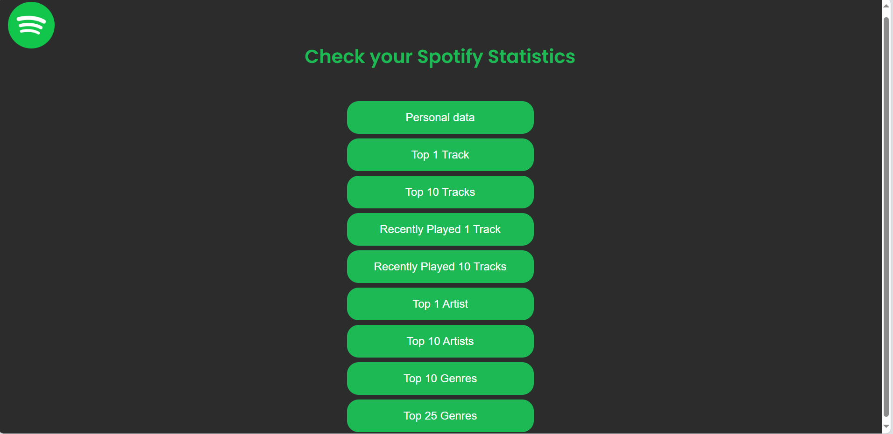

# Spotify API Project

This project is a Java-based application developed using Servlets, which interacts with Spotify's API to fetch and display music-related data. The backend is powered by Java Servlets, while the frontend is built with HTML and CSS for a simple yet functional user interface.

## Features
- Display albums, artists, and tracks from Spotify's API.
- User-friendly interface designed with HTML and styled with CSS.
- Seamless integration of Spotify's API for real-time data retrieval.

## Installation
To run this application locally, follow these steps:
1. Clone this repository.
2. Set up a local server (e.g., Apache Tomcat).
3. Configure Spotify API credentials in the application.

## Screenshots
Below are some screenshots of the application interface:

